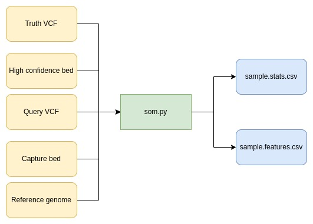

# eggd_sompy (DNAnexus Platform App)

## What does this app do?
Somatic Variant Benchmarking Tool. Calculates recall, precision,
true positives (tp), false postive (fp), false negative (fn) between truth and query VCF for somatic samples.

The program som.py is based off hap.py by Illumina https://github.com/Illumina/hap.py/blob/master/doc/sompy.md

## What are the inputs?

- Truth VCF
- High confidence bed
- Query VCF
- Capture bed
- Reference genome (.fa.gz)
- Hap.py docker
- Query VCF filename (string)

## What are the outputs?

- sample.stats.csv (contains the overall metrics for SNPs and Indels)
- sample.feature.csv (contains the variants that are tp,fp and fn)

## What are the limitations of this app
- Requires "chr" to be present